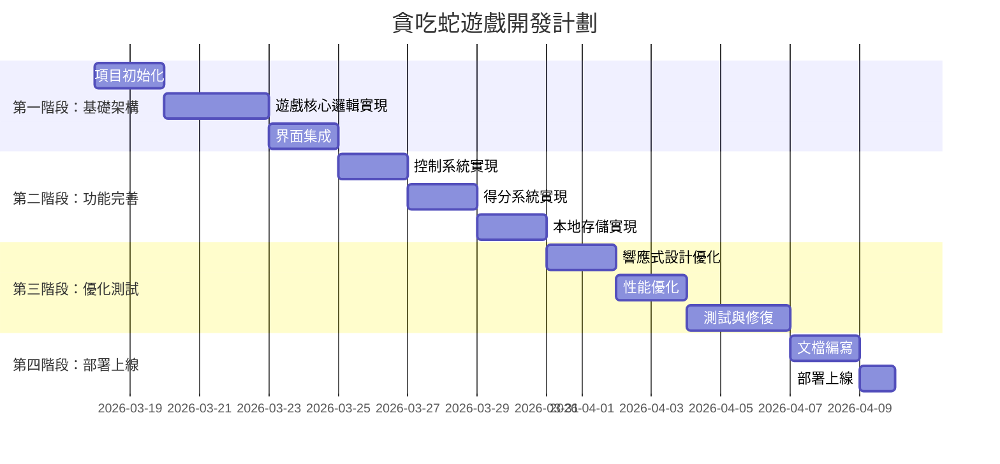

# 貪吃蛇遊戲產品需求文檔 (Snake Game PRD)

## 1. 項目概述

### 1.1 項目名稱
**Greedy Snake - 多平台貪吃蛇遊戲**

### 1.2 項目描述
開發一個現代化的貪吃蛇遊戲，基於現有HTML/CSS界面設計，添加完整的遊戲邏輯和功能。遊戲將支持多平台（手機、iPad、電腦），包含響應式設計、觸控/鍵盤控制、本地排行榜系統，並可擴展為多人在線功能。

### 1.3 項目目標
- 創建一個具有現代UI/UX的貪吃蛇遊戲
- 實現跨平台兼容性（響應式設計）
- 提供流暢的遊戲體驗和直觀的控制方式
- 建立完整的遊戲系統（計分、排行榜、遊戲狀態管理）
- 為未來擴展（多人在線、社交功能）奠定基礎

## 2. 現有資產分析

### 2.1 現有文件
```
snake_test/
├── greedy_snake_gameplay/
│   ├── code.html          # 遊戲主界面HTML
│   └── screen.png         # 界面截圖
└── game_rankings_leaderboard/
    ├── code.html          # 排行榜界面HTML
    └── screen.png         # 界面截圖
```

### 2.2 現有界面特點
1. **遊戲主界面** (`greedy_snake_gameplay/code.html`)
   - 現代化設計，使用Tailwind CSS
   - 粉色主題配色方案（primary: #ec6fa5）
   - 包含遊戲網格、蛇頭/身體、食物元素
   - 方向控制按鈕（上、下、左、右）
   - 遊戲控制按鈕（暫停、重置、加速）
   - 分數顯示（當前分數、最高分數）
   - 底部導航欄

2. **排行榜界面** (`game_rankings_leaderboard/code.html`)
   - 完整的排行榜UI設計
   - 前三名特殊展示（獎盃、頭像、分數）
   - 玩家列表（頭像、名稱、等級、分數、排名變化）
   - 時間篩選（每日、每週、全部時間）
   - 底部導航欄

## 3. 功能需求

### 3.1 核心遊戲功能
| 功能模塊 | 詳細需求 | 優先級 |
|---------|---------|--------|
| **遊戲初始化** | 加載遊戲界面，初始化遊戲狀態，設置畫布 | 高 |
| **蛇的移動** | 蛇身跟隨頭部移動，方向控制，碰撞檢測 | 高 |
| **食物生成** | 隨機位置生成食物，食物被吃後重新生成 | 高 |
| **得分系統** | 吃食物得分，連擊獎勵，等級提升 | 高 |
| **碰撞檢測** | 牆壁碰撞、自身碰撞檢測 | 高 |
| **遊戲狀態** | 開始、暫停、繼續、結束、重置 | 高 |
| **控制方式** | 鍵盤方向鍵、WASD、觸控方向按鈕 | 高 |
| **響應式設計** | 適應不同屏幕尺寸（手機、平板、電腦） | 高 |

### 3.2 用戶界面功能
| 功能模塊 | 詳細需求 | 優先級 |
|---------|---------|--------|
| **遊戲主界面** | 顯示遊戲區域、分數、控制按鈕 | 高 |
| **排行榜界面** | 顯示玩家排名、分數、等級 | 高 |
| **設置界面** | 遊戲設置（難度、聲音、控制方式） | 中 |
| **遊戲結束界面** | 顯示最終分數、排名、重玩選項 | 高 |
| **導航系統** | 底部導航欄切換遊戲/排行榜/個人資料 | 中 |

### 3.3 數據管理功能
| 功能模塊 | 詳細需求 | 優先級 |
|---------|---------|--------|
| **本地存儲** | 使用localStorage保存最高分數、遊戲設置 | 高 |
| **排行榜數據** | 保存玩家分數、排名、遊戲記錄 | 高 |
| **遊戲狀態保存** | 暫停時保存當前遊戲狀態 | 中 |
| **數據導出/導入** | 導出遊戲數據備份 | 低 |

### 3.4 擴展功能（未來版本）
| 功能模塊 | 詳細需求 | 優先級 |
|---------|---------|--------|
| **多人在線** | 實時對戰、排行榜同步 | 低 |
| **社交功能** | 好友系統、挑戰分享 | 低 |
| **遊戲皮膚** | 自定義蛇的外觀、遊戲主題 | 低 |
| **成就系統** | 遊戲成就、徽章收集 | 低 |
| **聲音效果** | 背景音樂、音效 | 中 |

## 4. 技術架構

### 4.1 技術棧選擇
```
前端技術:
- HTML5 Canvas: 遊戲渲染
- JavaScript (ES6+): 遊戲邏輯
- Phaser.js (可選): 遊戲引擎
- Tailwind CSS: 樣式框架
- LocalStorage: 本地數據存儲

開發工具:
- VS Code: 代碼編輯器
- Git: 版本控制
- Chrome DevTools: 調試工具

部署:
- 靜態文件服務器 (GitHub Pages, Netlify, Vercel)
```

### 4.2 架構方案比較
| 方案 | 優點 | 缺點 | 推薦度 |
|------|------|------|--------|
| **純Canvas + JS** | 輕量級，完全控制，性能好 | 開發複雜度高，需要手動處理動畫 | ★★★★☆ |
| **Phaser.js引擎** | 遊戲開發框架，內置物理引擎，社區支持好 | 學習曲線，文件體積較大 | ★★★☆☆ |
| **React + Canvas** | 組件化，狀態管理方便 | 過度工程化，性能開銷 | ★★☆☆☆ |

**推薦方案**: 使用HTML5 Canvas + 純JavaScript開發，後期可考慮集成Phaser.js用於複雜遊戲功能。

### 4.3 文件結構規劃
```
snake_game/
├── index.html              # 主入口文件
├── css/
│   ├── styles.css          # 自定義樣式
│   └── responsive.css      # 響應式樣式
├── js/
│   ├── game.js             # 遊戲核心邏輯
│   ├── snake.js            # 蛇類定義
│   ├── food.js             # 食物類定義
│   ├── score.js            # 分數系統
│   ├── controls.js         # 控制系統
│   ├── ui.js               # 界面管理
│   ├── storage.js          # 本地存儲
│   └── main.js             # 應用入口
├── assets/
│   ├── images/             # 圖片資源
│   └── sounds/             # 音效資源
└── lib/                    # 第三方庫
```

## 5. 遊戲設計規格

### 5.1 遊戲規則
1. **基本規則**:
   - 玩家控制蛇在網格中移動
   - 蛇頭碰到食物時，蛇身長度增加，分數增加
   - 蛇頭碰到牆壁或自身身體時，遊戲結束
   - 遊戲難度隨等級提升（蛇移動速度加快）

2. **得分規則**:
   - 普通食物: +10分
   - 特殊食物: +50分（隨機出現）
   - 連擊獎勵: 連續吃食物有額外加分
   - 等級提升: 每100分提升一個等級

3. **遊戲難度**:
   - 簡單: 蛇速慢，網格20×20
   - 中等: 蛇速中等，網格25×25
   - 困難: 蛇速快，網格30×30

### 5.2 控制方式
1. **桌面端**:
   - 方向鍵: ↑ ↓ ← →
   - WASD鍵: W A S D
   - 空格鍵: 暫停/繼續
   - R鍵: 重置遊戲

2. **移動端**:
   - 觸控方向按鈕（現有界面設計）
   - 滑動手勢控制
   - 屏幕點擊暫停

### 5.3 界面設計規格
1. **遊戲區域**:
   - 網格大小: 根據屏幕尺寸動態調整
   - 網格單元: 20px × 20px（桌面端），15px × 15px（移動端）
   - 背景: 網格背景（現有設計）

2. **蛇的設計**:
   - 頭部: 粉色圓角矩形，帶有眼睛
   - 身體: 漸變粉色，透明度遞減
   - 長度: 初始長度3-5個單元

3. **食物的設計**:
   - 普通食物: 藍色圓形，脈動動畫
   - 特殊食物: 金色星星，旋轉動畫

## 6. 開發計劃

### 6.1 開發階段


### 6.2 里程碑
1. **M1: 基礎遊戲原型** (第1週)
   - 蛇的移動和食物生成
   - 基本碰撞檢測
   - 簡單得分系統

2. **M2: 完整遊戲功能** (第2週)
   - 所有控制方式實現
   - 遊戲狀態管理
   - 界面集成

3. **M3: 數據管理系統** (第3週)
   - 本地排行榜
   - 遊戲設置保存
   - 響應式設計

4. **M4: 優化與部署** (第4週)
   - 性能優化
   - 跨平台測試
   - 部署上線

## 7. 測試計劃

### 7.1 測試類型
1. **功能測試**:
   - 遊戲邏輯測試（移動、碰撞、得分）
   - 控制方式測試（鍵盤、觸控）
   - 界面交互測試

2. **兼容性測試**:
   - 瀏覽器兼容性（Chrome, Firefox, Safari, Edge）
   - 設備兼容性（手機、平板、桌面）
   - 屏幕尺寸測試（響應式設計）

3. **性能測試**:
   - 遊戲幀率測試（目標60fps）
   - 內存使用測試
   - 加載時間測試

4. **用戶體驗測試**:
   - 控制流暢度
   - 界面直觀性
   - 遊戲難度平衡

### 7.2 測試工具
- Jest: JavaScript單元測試
- Cypress: 端到端測試
- Lighthouse: 性能測試
- BrowserStack: 跨瀏覽器測試

## 8. 風險管理

### 8.1 技術風險
| 風險描述 | 影響程度 | 緩解措施 |
|---------|---------|---------|
| Canvas性能問題 | 中 | 優化渲染邏輯，使用requestAnimationFrame |
| 移動端觸控延遲 | 中 | 使用touch事件優化，添加視覺反饋 |
| 瀏覽器兼容性 | 低 | 使用特性檢測，提供降級方案 |
| 本地存儲限制 | 低 | 數據壓縮，定期清理舊數據 |

### 8.2 項目風險
| 風險描述 | 影響程度 | 緩解措施 |
|---------|---------|---------|
| 開發時間不足 | 中 | 優先實現核心功能，簡化非必要特性 |
| 需求變更 | 中 | 保持模塊化設計，便於擴展 |
| 團隊協作問題 | 低 | 明確分工，定期進度同步 |

## 9. 成功標準

### 9.1 技術成功標準
- 遊戲在主流瀏覽器上流暢運行（60fps）
- 移動端觸控響應時間 < 100ms
- 遊戲加載時間 < 3秒
- 代碼覆蓋率 > 80%

### 9.2 產品成功標準
- 用戶完成率 > 70%（開始遊戲的用戶完成至少一局）
- 平均遊戲時長 > 5分鐘
- 用戶評分 > 4/5星
- 排行榜參與率 > 50%

### 9.3 商業成功標準
- 月活躍用戶 > 1,000
- 用戶留存率（7日） > 30%
- 社交分享率 > 10%

## 10. 附錄

### 10.1 參考資源
- [HTML5 Canvas文檔](https://developer.mozilla.org/en-US/docs/Web/API/Canvas_API)
- [Phaser.js官方文檔](https://phaser.io/)
- [Tailwind CSS文檔](https://tailwindcss.com/)
- [LocalStorage API](https://developer.mozilla.org/en-US/docs/Web/API/Window/localStorage)

### 10.2 設計資源
- 現有界面設計文件（HTML/CSS）
- 顏色方案：primary: #ec6fa5, secondary: #95c9ec
- 字體：Spline Sans

### 10.3 聯繫信息
- 項目負責人: [待指定]
- 技術負責人: [待指定]
- 設計負責人: [待指定]
- 測試負責人: [待指定]

---

**文檔版本**: 1.0  
**創建日期**: 2026-03-17  
**最後更新**: 2026-03-17  
**狀態**: 草案（待審查）